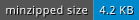

[](https://travis-ci.com/avitex/rust-badgen)
[](https://crates.io/crates/badgen)
[](https://docs.rs/badgen)

# rust-badgen

**A Rust implementation of [github.com/badgen/badgen](https://github.com/badgen/badgen).**  
Documentation hosted on [docs.rs](https://docs.rs/badgen).

```toml
[dependencies]
badgen = "0.1"
```

## Examples

**Classic**


```rust
let badge = badgen::badge(&badgen::Style::classic(), "4.2 KB", Some("minzipped size")).unwrap();
println!("{}", badge);
```

**Flat**



```rust
let badge = badgen::badge(&badgen::Style::flat(), "4.2 KB", Some("minzipped size")).unwrap();
println!("{}", badge);
```
